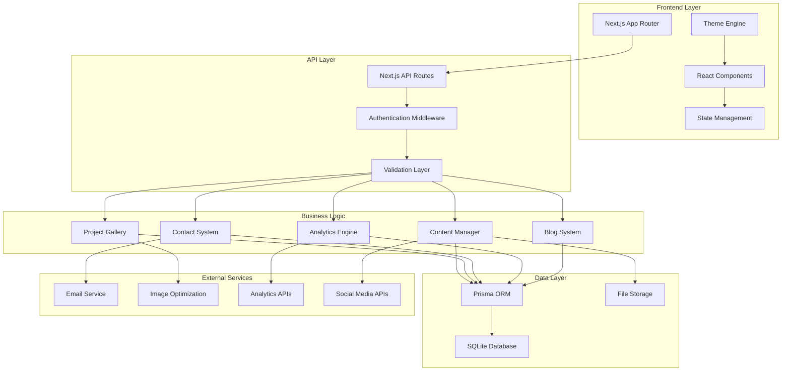
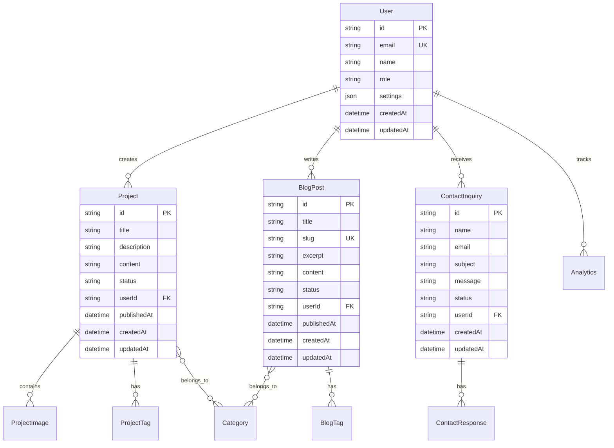

# Design Document

## Overview

The Portfolio Platform will transform the existing static Next.js portfolio into a comprehensive, dynamic portfolio management system. The design maintains the current modern aesthetic while adding robust backend functionality, content management capabilities, and enhanced user interactions. The system will be built using a modular architecture that supports scalability and maintainability.

## Architecture

### System Architecture



### Database Architecture

The system will extend the existing Prisma schema with additional models to support the portfolio platform functionality:



## Components and Interfaces

### Frontend Components

#### 1. Admin Dashboard Components
- **AdminLayout**: Main layout wrapper with navigation and authentication
- **ContentEditor**: Rich text editor for blog posts and project descriptions
- **ProjectManager**: CRUD interface for managing portfolio projects
- **MediaUploader**: Drag-and-drop interface for uploading and organizing media
- **AnalyticsDashboard**: Visual charts and metrics display
- **ThemeCustomizer**: Real-time theme editing interface

#### 2. Public Interface Components
- **ProjectGrid**: Enhanced project gallery with filtering and search
- **ProjectModal**: Detailed project view with image carousel
- **BlogList**: Paginated blog post listing with categories
- **BlogPost**: Individual blog post display with sharing options
- **ContactForm**: Enhanced contact form with validation and status feedback
- **SearchInterface**: Global search functionality across projects and blog posts

#### 3. Shared Components
- **ImageOptimizer**: Automatic image optimization and format selection
- **LoadingStates**: Skeleton loaders and progress indicators
- **ErrorBoundary**: Graceful error handling and user feedback
- **SEOHead**: Dynamic meta tag generation for each page

### API Interfaces

#### 1. Content Management APIs
```typescript
// Project Management
POST /api/projects - Create new project
GET /api/projects - List projects with filtering
GET /api/projects/[id] - Get specific project
PUT /api/projects/[id] - Update project
DELETE /api/projects/[id] - Delete project

// Blog Management
POST /api/blog - Create new blog post
GET /api/blog - List blog posts with pagination
GET /api/blog/[slug] - Get specific blog post
PUT /api/blog/[id] - Update blog post
DELETE /api/blog/[id] - Delete blog post

// Media Management
POST /api/media/upload - Upload media files
GET /api/media - List media files
DELETE /api/media/[id] - Delete media file
```

#### 2. Public APIs
```typescript
// Public Content
GET /api/public/projects - Get published projects
GET /api/public/blog - Get published blog posts
GET /api/public/search - Search across content

// Contact System
POST /api/contact - Submit contact form
GET /api/contact/inquiries - List inquiries (admin only)
PUT /api/contact/inquiries/[id] - Update inquiry status

// Analytics
POST /api/analytics/track - Track user interactions
GET /api/analytics/stats - Get analytics data (admin only)
```

## Data Models

### Extended Prisma Schema

```prisma
model User {
  id        String   @id @default(cuid())
  email     String   @unique
  name      String?
  role      Role     @default(USER)
  settings  Json?
  createdAt DateTime @default(now())
  updatedAt DateTime @updatedAt
  
  projects        Project[]
  blogPosts       BlogPost[]
  contactInquiries ContactInquiry[]
  analytics       Analytics[]
}

model Project {
  id          String    @id @default(cuid())
  title       String
  slug        String    @unique
  description String?
  content     String?
  status      Status    @default(DRAFT)
  featured    Boolean   @default(false)
  sortOrder   Int       @default(0)
  publishedAt DateTime?
  createdAt   DateTime  @default(now())
  updatedAt   DateTime  @updatedAt
  
  userId     String
  user       User     @relation(fields: [userId], references: [id])
  images     ProjectImage[]
  tags       ProjectTag[]
  categories ProjectCategory[]
}

model BlogPost {
  id          String    @id @default(cuid())
  title       String
  slug        String    @unique
  excerpt     String?
  content     String
  status      Status    @default(DRAFT)
  featured    Boolean   @default(false)
  publishedAt DateTime?
  createdAt   DateTime  @default(now())
  updatedAt   DateTime  @updatedAt
  
  userId     String
  user       User     @relation(fields: [userId], references: [id])
  tags       BlogTag[]
  categories BlogCategory[]
}

model ContactInquiry {
  id        String   @id @default(cuid())
  name      String
  email     String
  subject   String?
  message   String
  status    InquiryStatus @default(NEW)
  createdAt DateTime @default(now())
  updatedAt DateTime @updatedAt
  
  userId    String?
  user      User?    @relation(fields: [userId], references: [id])
  responses ContactResponse[]
}

model Analytics {
  id        String   @id @default(cuid())
  event     String
  page      String?
  data      Json?
  userAgent String?
  ipAddress String?
  createdAt DateTime @default(now())
  
  userId    String?
  user      User?    @relation(fields: [userId], references: [id])
}

enum Role {
  USER
  ADMIN
}

enum Status {
  DRAFT
  PUBLISHED
  ARCHIVED
}

enum InquiryStatus {
  NEW
  READ
  RESPONDED
  CLOSED
}
```

## Error Handling

### Error Handling Strategy

1. **Client-Side Error Handling**
   - React Error Boundaries for component-level errors
   - Form validation with real-time feedback
   - Network error handling with retry mechanisms
   - Graceful degradation for failed API calls

2. **Server-Side Error Handling**
   - Centralized error handling middleware
   - Structured error responses with appropriate HTTP status codes
   - Database transaction rollbacks on failures
   - Comprehensive logging for debugging

3. **User Experience**
   - Toast notifications for success/error states
   - Loading states during async operations
   - Fallback content for failed data loads
   - Clear error messages with actionable guidance

### Error Response Format
```typescript
interface ErrorResponse {
  success: false
  error: {
    code: string
    message: string
    details?: any
  }
  timestamp: string
}
```

## Testing Strategy

### Testing Approach

1. **Unit Testing**
   - Component testing with React Testing Library
   - API route testing with Jest
   - Database model testing with Prisma test environment
   - Utility function testing

2. **Integration Testing**
   - End-to-end user flows with Playwright
   - API integration testing
   - Database integration testing
   - Third-party service integration testing

3. **Performance Testing**
   - Lighthouse CI for performance monitoring
   - Load testing for API endpoints
   - Image optimization verification
   - Bundle size monitoring

4. **Accessibility Testing**
   - Automated accessibility testing with axe-core
   - Keyboard navigation testing
   - Screen reader compatibility testing
   - Color contrast validation

### Test Coverage Goals
- Unit tests: 80% code coverage minimum
- Integration tests: All critical user paths
- Performance tests: Core Web Vitals compliance
- Accessibility tests: WCAG 2.1 AA compliance

## Security Considerations

### Authentication & Authorization
- NextAuth.js for secure authentication
- Role-based access control (RBAC)
- JWT token management with secure storage
- Session management with automatic expiration

### Data Protection
- Input validation and sanitization
- SQL injection prevention through Prisma ORM
- XSS protection with Content Security Policy
- CSRF protection for form submissions

### File Upload Security
- File type validation and restrictions
- Virus scanning for uploaded files
- Secure file storage with access controls
- Image processing to strip metadata

### API Security
- Rate limiting to prevent abuse
- API key authentication for external services
- Request/response logging for audit trails
- HTTPS enforcement in production

## Performance Optimization

### Frontend Optimization
- Code splitting with Next.js dynamic imports
- Image optimization with next/image
- Static generation for public content
- Client-side caching with SWR or React Query

### Backend Optimization
- Database query optimization with Prisma
- Response caching for frequently accessed data
- Background job processing for heavy operations
- CDN integration for static assets

### Monitoring & Analytics
- Real User Monitoring (RUM) implementation
- Core Web Vitals tracking
- Error tracking and alerting
- Performance budgets and alerts

This design provides a comprehensive foundation for building a robust portfolio platform while maintaining the existing aesthetic and user experience. The modular architecture ensures scalability and maintainability as the platform grows.